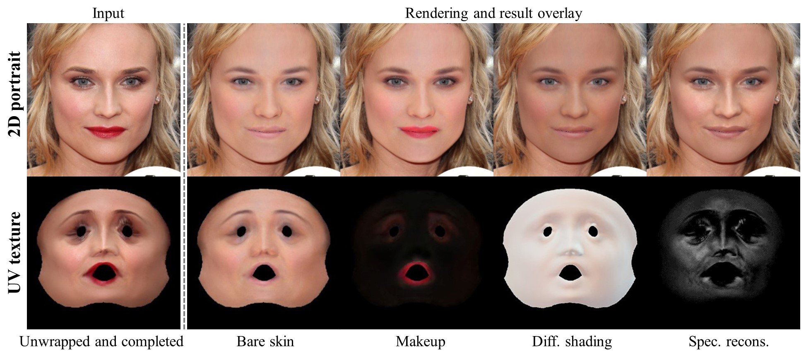

# Makeup Extraction of 3D Representation via Illumination-Aware Image Decomposition (Eurographics2023)
<a href='https://arxiv.org/abs/2302.13279'></a> &nbsp; 
<a href='https://yangxingchao.github.io/makeup-extract-page/'></a> &nbsp; 

The PyTorch code for the following paper:
> [**Makeup Extraction of 3D Representation via Illumination-Aware Image Decomposition**](https://yangxingchao.github.io/makeup-extract-page),  
> Xingchao Yang, Takafumi Taketomi, Yoshihiro Kanamori,   
> *Computer Graphics Forum (Proc. of Eurographics 2023)*


## Prerequisites
1. Python3
2. PyTorch with CUDA
4. Nvdiffrast

## Installation
Run the following commands for installing other packages:
```
pip install -r requirements.txt
```

## Inference
### Prepare prerequisite models
Download 3DMM model from [FLAME](https://flame.is.tue.mpg.de/) and put them into ```resources``` folder

We need the following models for our project:
```
albedoModel2020_FLAME_albedoPart.npz
FLAME_masks.pkl
FLAME_texture.npz
generic_model.pkl (from FLAME2020)
```

### Pretrained Models
Put the [trained models](https://drive.google.com/drive/folders/1lwkR9JcrbZ7fNylTSJQQEiGnt3s2LQYq?usp=sharing) to ```checkpoints/```.

### Demo  
Perform a sequence of processes on ```sample_img.jpg``` in the ```sample``` folder
1. Detect the landmark, and crop the image so that it aligns with the face. Then obtain an image of the skin area:
```
python step_0_preprocess.py
```

2. **Coarse Facial Material Reconstruction** corresponds to section 3.1 in the original paper.
```
python step_1_coarse_reconstruction.py
```

3. **UV Completion and Facial Material Refinement** corresponds to section 3.2 in the original paper.
```
python step_2_uv_completion.py
python step_3_material_refinement.py
```

4. **Makeup Extraction**  corresponds to section 3.3 in the original paper.
```
python step_4_makeup_extraction.py
```

The results of the execution can be found in the ```results``` folder

# Citation
If you find our work useful for your research, please consider citing our paper:
```bibtex
@article{makeup-extraction,
          author = {Yang, Xingchao and Taketomi, Takafumi and Kanamori, Yoshihiro},
          title = {Makeup Extraction of 3D Representation via Illumination-Aware Image Decomposition},
          journal = {Computer Graphics Forum},
          volume = {42},
          number = {2},
          pages = {293-307},
          year = {2023}
      }
```

### Acknowledgements
Here are some of the resources we benefit from:

* [Deep3DFaceRecon_pytorch](https://github.com/sicxu/Deep3DFaceRecon_pytorch)
* [pytorch_face_landmark](https://github.com/cunjian/pytorch_face_landmark)
* [face-parsing.PyTorch](https://github.com/zllrunning/face-parsing.PyTorch)
* [DECA](https://github.com/yfeng95/DECA)

